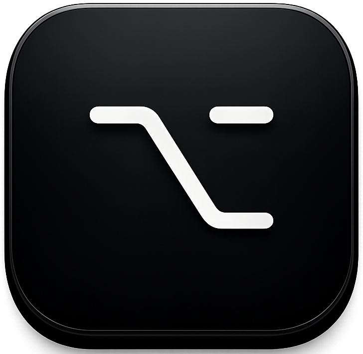
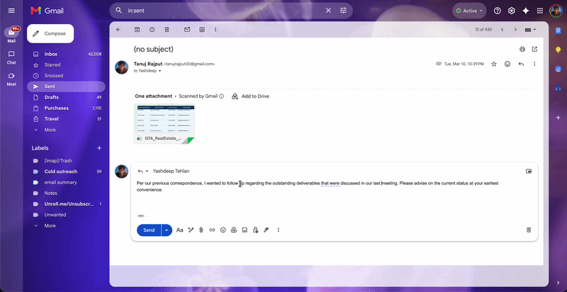
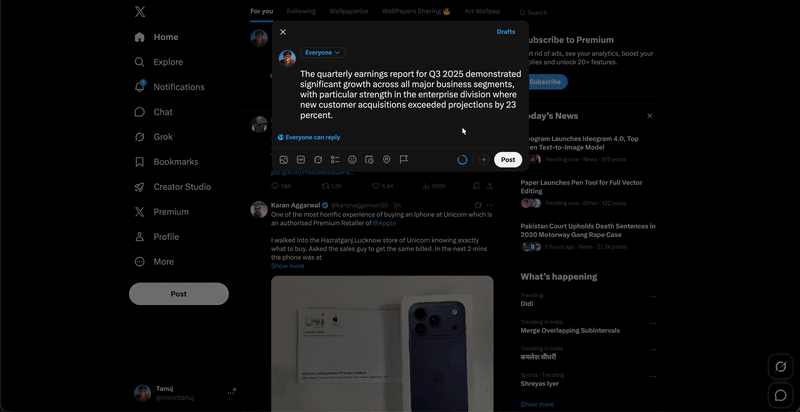

<div align="center">



# Alter

**AI lives in your clipboard now.**

Press **⌥ Space** in any app. Type a command. Done in ~1.5 seconds.

[Download .dmg](https://github.com/tanujrajputdev/alter/releases) · [How it works](#how-it-works) · [Features](#features) · [Build from source](#build-from-source)

</div>

---

## What is Alter?

Alter is a tiny macOS menu-bar app that turns your clipboard into an AI command line.

Copy any text. Press **⌥ Space**. A floating bar appears over your current window with your text pre-loaded. Type *"make this friendlier"*, *"translate to Hindi"*, *"shrink to one sentence"* — anything you'd type into ChatGPT. Hit Enter. ~1.5 seconds later the transformed text **auto-pastes where your cursor was**, in the app you came from.

No tab switch. No browser. No account. No subscription.

<div align="center">



</div>

---

## How it works

```
⌘C  →  ⌥ Space  →  type a command  →  Enter  →  Accept  →  pasted in your app
```

1. Copy any text from anywhere
2. Press **⌥ Space** — a floating command bar appears over your current app
3. Type what you want: *"make this friendlier"*, *"translate to Hindi"*, *"summarize"*
4. Hit Enter — Groq transforms it in ~1.5 s
5. Press Accept — the result pastes directly where your cursor is

You never leave the app you're in.

---

## Features

- **Floating HUD** — summons in any app via ⌥ Space, vanishes when you're done
- **8 one-click presets** — Rewrite, Shrink, Expand, Translate, Fix, Explain, Reply, Formal
- **⌘K** opens the full preset library inline (browse + search)
- **Custom commands** — type anything you'd type into ChatGPT
- **Auto-paste** — result lands where your cursor was, in the original app
- **~1.5 s end-to-end** — Groq `llama-3.3-70b-versatile` with `llama3-8b` fallback
- **macOS Keychain** — API key encrypted via `safeStorage`
- **Menu-bar only** — zero Dock clutter, custom template tray icon
- **No account, no telemetry** — bring your own free Groq key

### Dashboard

A separate menu-bar window for everything that doesn't belong in the HUD:

<div align="center">



</div>

- **Presets** — manage your library of one-click transforms, add your own
- **History** — every transform you've made, searchable
- **Settings** — change hotkey, toggle features, manage permissions
- **API Key** — masked Groq key, copy/delete, status pill

---

## Install

### Option A — download the .dmg

1. Grab the latest `Alter-1.0.0-arm64.dmg` from [Releases](https://github.com/tanujrajputdev/alter/releases)
2. Open the DMG and drag **Alter** onto the **Applications** folder
3. First launch: right-click → Open (the build is unsigned)
4. Grant Accessibility permission when prompted (needed for auto-paste)
5. Paste your [Groq API key](https://console.groq.com/keys) on the setup screen

### Option B — build from source

```bash
git clone https://github.com/tanujrajputdev/alter
cd alter
npm install
npm run dev
```

To build a `.dmg`:

```bash
npm run dist
```

Output lands in `dist/`. Requires macOS. No Apple Developer account needed.

---

## Requirements

- macOS 13 Ventura or later (Apple Silicon + Intel)
- A free [Groq API key](https://console.groq.com/keys)
- Node.js 18+ (only if building from source)

---

## Hotkeys

| Key | Action |
|---|---|
| **⌥ Space** | Open / close the command bar |
| **Enter** | Submit command |
| **⌘ K** | Open preset library |
| **Escape** | Dismiss without changes |

---

## Privacy

- Your API key is encrypted at rest via **macOS Keychain** (`safeStorage`)
- Clipboard text is sent to `api.groq.com` **only** when you press Enter
- No analytics, no crash reporting, no remote logging
- No account, no signup — verify it all in the code

---

## Stack

| Layer | Technology |
|---|---|
| Desktop shell | Electron 33 |
| Build | electron-vite 2 + Vite 5 |
| UI | React 18 + TypeScript |
| AI | Groq API (`llama-3.3-70b-versatile`) |
| Icons | `@hugeicons/react` |
| Secrets | Electron `safeStorage` → macOS Keychain |
| Packaging | electron-builder → `.dmg` (arm64 + x64) |
| Hotkey | Electron `globalShortcut` |
| Paste | `osascript` keystroke |

---

## Architecture

See [ARCHITECTURE.md](ARCHITECTURE.md) for the decision log, IPC contract, data flow, and security model.

The TL;DR:

```
⌥ Space  →  main: globalShortcut fires  →  reads clipboard  →  shows HUD
           ↓
type command + Enter  →  renderer calls window.electronAPI.transform()
           ↓
main: fetch(api.groq.com)  →  ~1.5 s  →  result back to HUD
           ↓
Accept  →  main: clipboard.write + app.hide + activateApp(source) + osascript ⌘V
```

---

## Roadmap

See [ROADMAP.md](ROADMAP.md). Highlights:

- Voice command via Whisper (Groq)
- Multi-provider — OpenAI, Anthropic, local Ollama
- App-context awareness — knows you're in Slack vs. email vs. code
- Custom preset templates with variables
- Swift hotkey helper for Fn / CapsLock support

---

## Contributing

PRs welcome. Keep changes scoped, no telemetry, no dependencies that pull in megabytes of transitive deps.

---

## License

MIT. Build it, fork it, ship your own version.

---

<div align="center">

Built with <a href="https://groq.com/">Groq</a>, <a href="https://www.electronjs.org/">Electron</a>, and an obsession with not-leaving-the-app-you're-in.

</div>
